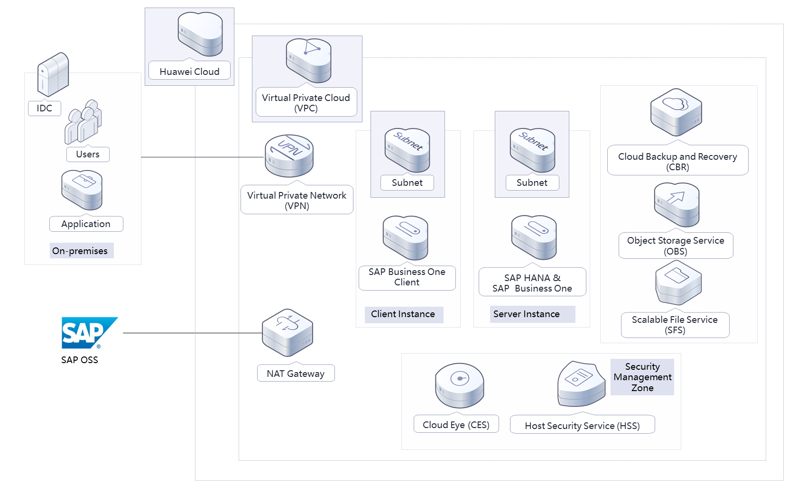
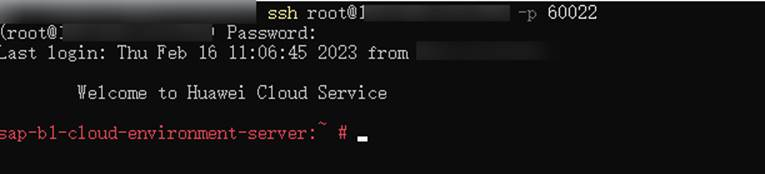
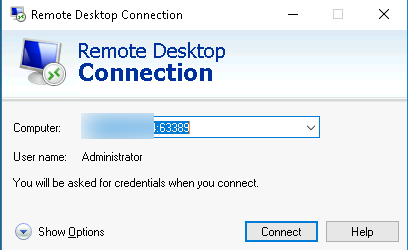

[TOC]

**Solution Overview**
===============
This solution helps you quickly deploy an environment for [SAP Business One](https://www.huaweicloud.com/intl/en-us/solution/sap-mb/business-one.html) on Huawei Cloud to facilitate digital transformation for your enterprises and provide a reliable, secure, and high-performance SAP Business One architecture. It is suitable for scenarios where enterprises want to quickly deploy SAP Business One at a low cost or migrate the SAP Business One system to the cloud.

For more details about this solution, visit: https://www.huaweicloud.com/intl/en-us/solution/implementations/qdcesapb1.html


**Architecture**
---------------


**Architecture Description**
---------------
This solution will:

1. Create a VPC and two subnets. The subnets are for server and client, respectively.
2. Create two security groups and configure security group rules to provide protection for ECSs.
3. Create two ECSs, one for SAP HANA and SAP Business One, and the other for SAP Business One Client.
4. Create seven EVS disks and use scripts to automatically mount the EVS disks to the corresponding directories of the two ECSs.
5. Use CBR to periodically back up data of the ECSs.
6. (Optional) Use SFS Turbo or OBS to back up SAP HANA.


**File Structure**
---------------

``` lua
huaweicloud-solution-rapid-deployment-of-sap-b1-cloud-environment
├── rapid-deployment-of-sap-b1-cloud-environment.tf.json -- Resource orchestration template
├── userdata
    ├── initialize-sap-b1-environment.sh   -- Script configuration file
```
**Getting Started**
---------------
1. On the [ECS console](https://console-intl.huaweicloud.com/ecm/?agencyId=WOmAijZnbElNjCFzTVDl4aJQAgdaTUMD&region=ap-southeast-3&locale=en-us#/ecs/manager/vmList), view the created ECSs.

2. Log in to the ECS where SAP Business One is to be deployed through SSH and use remote desktop to log in to the ECS where SAP Business One Client is to be deployed. Add the source IP address to the address group suffixed with **ipGroup-tcp22**. For example, if the public IP address of a local computer is **22***x.xx.xx.xx*, add the IP address to the address group. Then this compute can access the SAP Business One server through the port **22** and access the SAP Business One Client through the port **3389**. Use the corresponding tool on this computer to access port **60022** or **63389**, which is configured in the DNAT rule of the NAT Gateway to map port **22** or **3389**.

	Figure 1 Connecting to the SAP Business One server using SSH

	

	Figure 2 Connecting to SAP Business One Client through remote desktop

	

3. Perform the installation by referring to [Huawei Cloud SAP Business One on HANA Installation Best Practice](https://support.huaweicloud.com/intl/en-us/bestpractice-sap/en-us_topic_0000001193863361.html).

